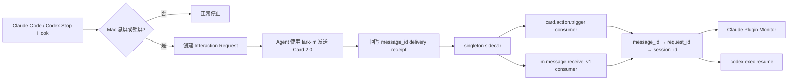

# larky

Larky 在 Claude Code 或 Codex 的一轮任务结束时检查 Mac 是否已息屏或锁屏；若使用者已经离开，它让 Agent 通过全局可用的 `lark-im` Skill 发送飞书 Card 2.0。使用者点击卡片或回复消息后，单例 sidecar 会把输入精确路由回原始 Agent session。

名称来自 Lark，也与 lucky 同音。

## 工作方式



一个飞书私聊可以承载多个 Agent session。`chat_id` 只标识消息入口，不能标识应该恢复哪个任务；Larky 使用下面的链路精确寻址：

`reply_to/root_id → outbound_message_id → request_id → platform + agent_session_id`

无法唯一匹配的消息会进入 unrouted inbox，不会猜“最近会话”，也不会广播。

## V1 能力

- Go 单一可执行文件；支持 macOS arm64 与 amd64 的原生构建。
- CoreGraphics 检测显示器休眠与锁屏；只有 `display_asleep OR screen_locked` 才通知。
- Card 2.0 是首版默认交互面，包含继续、关闭、重试、取消、选项与文字表单契约。
- `card.action.trigger` 与 `im.message.receive_v1` 各只有一个长期 consumer。
- Stop Hook 会等到两个 consumer 都发出官方 ready marker 后才允许 Agent 发送卡片；`sidecar status` 会分别报告就绪状态。
- Hook 会比较当前 binary 与 sidecar 的启动摘要；升级后自动重启旧 sidecar，避免旧进程回写并丢失新状态字段。
- Claude Code 使用 Stop Hook + Plugin Monitor；Codex 使用 Stop Hook + 精确 session resume adapter。
- request TTL、允许的飞书用户/群、回调 action allowlist、事件去重、原子 claim 和按 session 串行队列。
- pending request 期间仅阻止系统 idle sleep，不阻止显示器休眠。
- L0–L4 分层验证与 source-digest receipt；fixture 事件不能冒充真实 E2E。

Larky 不安装或配置 `lark-cli`、`lark-im`、`lark-event`，也不处理飞书应用、登录、权限或回调配置。它假设这些能力已全局可用。

## 前置条件

- macOS。
- Go 1.24+（仅从源码构建时需要）。
- Claude Code 2.1.105+；Plugin Monitor 只在交互式 CLI session 中运行。
- 支持 lifecycle Hooks 的 Codex CLI。
- 已全局可用并配置好的 `lark-cli`、`lark-im` 与 `lark-event`。

## 构建和配置

```bash
make build

./dist/larky config set \
  --target-user ou_xxx \
  --allowed-user ou_xxx

./dist/larky doctor
```

已经知道固定私聊的 `chat_id` 时，也可以用 `--chat-id oc_xxx` 代替 `--target-user`。`--allowed-user` 可以重复指定。也可以用 `LARKY_CHAT_ID`、`LARKY_TARGET_USER_ID`、`LARKY_ALLOWED_USER_IDS`、`LARKY_LARK_CLI`、`LARKY_CODEX_CLI` 和 `LARKY_STATE_DIR` 覆盖本地配置。

状态默认保存在 `~/Library/Application Support/larky`，目录与 Unix socket 权限均限制为当前用户。

## 本地加载插件

Claude Code 开发模式：

```bash
claude --plugin-dir "$PWD/plugins/claude"
```

Codex 插件根目录是 `plugins/codex/larky`。发布包内含本地 marketplace，可将解压目录交给 `codex plugin marketplace add`，再安装 `larky@larky`。源码开发时先运行 `make build`，两个插件 launcher 会自动找到 `dist/larky`。

Plugin Hook 首次运行前，Claude Code / Codex 都可能要求使用者审核本地 Hook。Larky 不绕过宿主的 Hook trust 或工具审批。

## CLI

```text
larky away
larky config set|show
larky doctor
larky sidecar run|status|stop
larky subscribe --platform claude --session-id <UUID>
larky hook stop --platform claude|codex
larky delivery record|fail
larky verify plan|run|status
```

`debug ingest` 只用于 fixture replay，写入的事件永远带 `synthetic=true`，不能满足 L4。

## 安全边界

- 飞书回复是普通不可信用户输入，不是系统指令或权限批准。
- 只接受配置中的 `chat_id` 与 `open_id`、未过期 request、唯一 message/request 映射和 allowlist action。
- callback payload 不包含 session ID、路径、任务正文或命令。
- `close` / `cancel` 只关闭本地 request；不会启动新 Agent turn。
- Codex remote turn 按 session 串行执行。远程 turn 运行时不要同时在另一个终端向同一 session 手动提交 prompt，以免宿主 transcript 交错。

## 自动验证

```bash
make build
./dist/larky verify plan
./dist/larky verify run --through 3
./dist/larky verify status
```

验证收据写入 `.artifacts/verification/<run_id>/receipt.json`，并绑定当前 source digest：

- L0：格式、event/parser、插件与 Skill 契约。
- L1：全部确定性单元与组件测试。
- L2：`go vet` 与 race detector。
- L3：真实构建产物、fake Lark、Claude/Codex exact-session 边界与宿主插件校验。
- L4：真实 CoreGraphics away 状态、真实 Card 2.0 delivery、真实非 synthetic 卡片回调，以及原 session 已接受并完成 handoff；仍在队列中的回复不能通过。

L4 需要一次真实的人机动作：分别让 Claude Code 和 Codex 在 Mac 已锁屏/息屏时自然触发 Stop Hook，然后从飞书点击卡片的非终止操作。回到电脑后运行：

```bash
./dist/larky verify run --through 4
```

只有 request 记录了 `away_method=coregraphics`、Card 未降级、回调来自 `lark-live` 且 `synthetic=false` 时，L4 才会通过。修改任何源文件后旧收据会自动失效。

## 开发

```bash
go test ./...
go vet ./...
go test -race ./...
make validate
make package
```

`make package` 生成当前架构的 Claude Code、Codex 与裸 binary 压缩包；发布流程在 arm64 与 amd64 runner 上分别生成产物。
