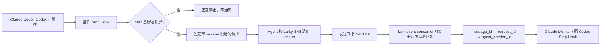

# larky

Larky 是一个 **Claude Code / Codex 原生插件**，不是一个需要使用者手工启动的独立应用。

安装后，Coding Agent 的 Stop Hook 会在每轮任务停下时自动检查 Mac 是否已息屏或锁屏。若使用者已经离开，插件会让 Agent 通过全局可用的 `lark-im` Skill 发送飞书 Card 2.0；使用者点击卡片或回复消息后，Larky 会把输入精确送回原始 Agent session。对 Codex App 来说，回复会直接续在侧边栏里的原任务中，不会另起一个不可见的 `codex exec resume` 会话。

名称来自 Lark，也与 lucky 同音。

## 安装后怎么使用

前提是本机已经完成 `lark-cli`、`lark-im`、`lark-event` 的安装、登录和权限配置。Larky 不重复管理这些内容。

运行一次安装命令：

```bash
curl -fsSL https://raw.githubusercontent.com/jtsang4/larky/main/install.sh | sh
```

安装器会校验 GitHub Release 的 SHA-256，安装当前 Mac 架构对应的 runtime，并通过 Claude Code / Codex 自己的 marketplace 命令注册 `larky@larky` 插件。PATH 中同时存在两个 Agent 时会同时安装；也可以只安装一个：

```bash
curl -fsSL https://raw.githubusercontent.com/jtsang4/larky/main/install.sh | sh -s -- --claude
curl -fsSL https://raw.githubusercontent.com/jtsang4/larky/main/install.sh | sh -s -- --codex
```

然后重启 Coding Agent 或新建一个任务，并按宿主提示审核一次插件 Hook。此后照常使用 Claude Code 或 Codex 即可：

1. 不需要运行 `larky` 命令。
2. 不需要启动 sidecar。
3. 不需要在 prompt 中点名 Larky Skill。
4. 不需要单独配置通知对象。

当任务停下且 Mac 已息屏或锁屏时，插件自动介入；Mac 仍在使用时不会发送消息。

Larky 默认读取 `lark-cli auth status --json` 中的当前登录用户 `open_id`，向该用户发送机器人私聊，并且只接受该用户的回复。因此，正常的单用户场景没有 Larky 首次配置步骤。

## 为什么采用插件，而不是单独的 CLI 或 MCP

Larky 需要响应 Agent 的生命周期，并恢复准确的原会话，所以核心交付物是宿主原生插件：

| 宿主 | 插件内的原生机制 | 用途 |
|---|---|---|
| Claude Code | Stop Hook + Larky Skill + Plugin Monitor | 自动检测停止、让 Agent 用 `lark-im` 发卡片、把回复送回准确会话 |
| Codex App / CLI | Stop Hook continuation + SessionStart recovery + Larky Skill | 原任务的 Hook 原地等待并直接续跑；App 重启后重新打开原任务时恢复已排队回复 |

MCP 更适合提供工具，不负责“任务停下时自动执行”这个生命周期入口。Lark 已经由全局 Skills 和 `lark-cli` 提供消息与事件能力，因此 Larky 只打包编排所需的 Hook、Skill、Claude Monitor 和本地 runtime，不再复制一套 Lark MCP 或登录配置。

一键安装脚本只是跨两个宿主安装架构相关 binary 和原生插件的分发层。日常使用发生在 Claude Code / Codex 内部，不发生在脚本或 CLI 里。

## 更新

重复运行安装命令即可幂等升级：

```bash
curl -fsSL https://raw.githubusercontent.com/jtsang4/larky/main/install.sh | sh
```

也可以使用维护命令；它会走同一条校验过的安装路径，并更新已检测到的插件：

```bash
larky update
larky update --all
larky update --codex
larky update --version v0.2.0
```

升级后重启 Coding Agent 或新建任务，使新版本的 Skill 和 Hook 生效。

## 如何确认插件已经安装

```bash
claude plugin list
codex plugin list
```

两边都应显示 marketplace `larky` 中的 `larky@larky`。`larky doctor` 是可选的诊断命令，不是正常使用步骤。

## 工作方式



一个飞书机器人私聊可以同时承载多个 Agent session。`chat_id` 只标识消息入口，不能标识应该恢复哪个任务；Larky 使用下面的链路精确寻址：

`reply_to/root_id → outbound_message_id → request_id → platform + agent_session_id`

无法唯一匹配的消息会进入 unrouted inbox，不会猜“最近会话”，也不会广播到多个会话。

## 前置条件与边界

- macOS arm64 或 amd64。
- Claude Code 2.1.105+；Plugin Monitor 只在交互式 CLI session 中运行。
- 支持 lifecycle Hooks 的 Codex CLI。
- 已全局可用并配置好的 `lark-cli`、`lark-im` 与 `lark-event`。
- Larky 不安装或配置 Lark CLI/Skills，不处理飞书应用、登录、权限或事件回调配置。
- Codex App 或 Claude Code 进程必须保持运行，Mac 也必须由使用者自己的工具保持唤醒和联网；Larky 不调用 `caffeinate`，也不修改系统休眠设置。

## Codex App 如何保持原任务

Codex App 没有面向第三方插件开放“按 thread id 向既有任务注入消息”的稳定外部接口。Larky 因此使用 Codex 已公开的 lifecycle Hook 语义：第一次 Stop continuation 让当前 Agent 发卡片；第二次递归 Stop 不结束，而是在**同一个 App 任务的同一个 Hook 调用**里等待。飞书事件经 singleton sidecar 路由到这个 session 后，Hook 返回新的 continuation，Codex 会在原任务内继续模型循环。

这带来三个可验证的行为：

1. 多个 App 任务可以同时等待，但全机仍只有每个 EventKey 一个飞书 consumer。
2. A 卡片的 callback 只能解除 A 任务的 Hook；B 任务不会被唤醒。
3. 解锁或点亮屏幕后，等待中的 Hook 会在约一秒内释放，使用者可以直接在原任务继续。若 App 在等待期间被重启，回复仍保留在准确的 session inbox；重新打开原任务时，`SessionStart(resume)` 会把它注入该任务作为恢复兜底。

因此不要同时使用 `codex exec resume`、另一个 Codex 进程或新任务来消费同一条回复。Larky 的 L4 验证也只接受 `codex_stop_hook` 的真实交付证据，`SessionStart` 兜底不能冒充自动续跑成功。

## 高级覆盖配置

只有需要把通知发到固定群聊、另一个用户，或允许多个回复者时，才需要覆盖自动发现的当前用户：

```bash
larky config set --chat-id oc_xxx --allowed-user ou_xxx

# 或发送给指定用户；未指定 allowed-user 时默认只允许该用户回复
larky config set --target-user ou_xxx
```

`--allowed-user` 可以重复指定。也可以用 `LARKY_CHAT_ID`、`LARKY_TARGET_USER_ID`、`LARKY_ALLOWED_USER_IDS`、`LARKY_LARK_CLI` 和 `LARKY_STATE_DIR` 覆盖。状态默认保存在 `~/Library/Application Support/larky`，目录与 Unix socket 仅限当前用户访问。

## 安全边界

- 飞书回复是普通不可信用户输入，不是系统指令或权限批准。
- 只接受已绑定的 `chat_id`、允许的 `open_id`、未过期 request、唯一 message/request 映射和 allowlist action。
- callback payload 不包含 session ID、路径、任务正文、命令或权限决定。
- `close` / `cancel` 只关闭本地 request，不启动新 Agent turn。
- Codex 回复只由原任务的 Stop Hook 消费；不要在另一个终端同时向同一 session 提交 prompt。

## V1 能力

- Go 单一可执行文件；支持 macOS arm64 与 amd64 原生构建。
- CoreGraphics 检测显示器休眠与锁屏；只有 `display_asleep OR screen_locked` 才通知。
- Card 2.0 是首版默认交互面，包含继续、关闭、重试、取消、选项与文字表单契约。
- `card.action.trigger` 与 `im.message.receive_v1` 各只有一个长期 consumer。
- Stop Hook 会等到两个 consumer 都发出官方 ready marker 后才允许 Agent 发送卡片。
- Claude Code 使用 Plugin Monitor；Codex App / CLI 使用原任务内的长驻 Stop Hook，并以 SessionStart 作为进程重启后的恢复兜底。
- request TTL、回复者 allowlist、回调 action allowlist、事件去重、原子 claim 和按 session 串行队列。
- Larky 不阻止系统或显示器休眠；保持主机唤醒由使用者已有的软件负责。
- L0–L4 分层验证与 source-digest receipt；fixture 事件不能冒充真实 E2E。

## 开发与验证

从源码加载 Claude Code 插件：

```bash
make build
claude --plugin-dir "$PWD/plugins/claude"
```

Codex 插件根目录是 `plugins/codex/larky`。发布包会把架构对应的 binary 与两个宿主的 marketplace 一起打包；源码中的 launcher 则会查找 `dist/larky`。

```bash
go test ./...
go vet ./...
go test -race ./...
make validate
make package
```

自动验证：

```bash
./dist/larky verify plan
./dist/larky verify run --through 3
./dist/larky verify status
```

L0–L3 覆盖格式、契约、单元测试、race、真实构建产物、fake Lark、准确会话路由和宿主插件校验。L4 额外要求 Claude Code 与 Codex 在真实息屏/锁屏状态自然触发 Stop Hook，收到真实的非 synthetic 飞书卡片回调，并留下准确宿主交付证据。Codex 必须是 `codex_stop_hook`，证明 continuation 回到了原 App 任务：

```bash
./dist/larky verify run --through 4
```

验证收据写入 `.artifacts/verification/<run_id>/receipt.json` 并绑定当前 source digest；修改源文件后旧收据自动失效。

仅安装裸 binary、完全不注册插件是开发或诊断用途：

```bash
curl -fsSL https://raw.githubusercontent.com/jtsang4/larky/main/install.sh | sh -s -- --binary-only
```
